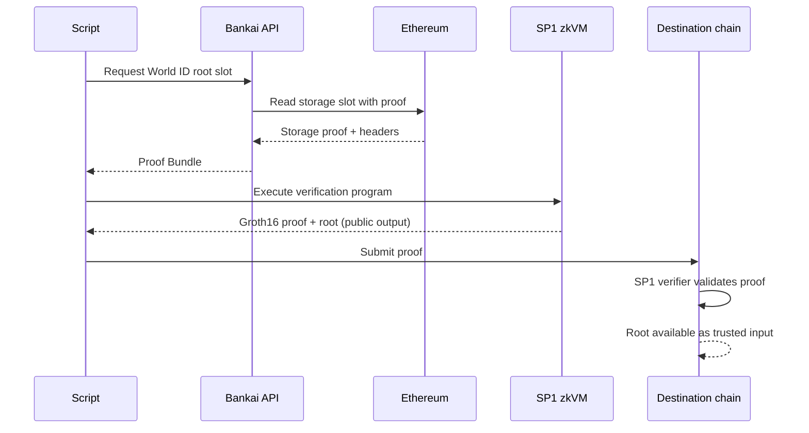

# Trustless multichain proof of humanity with Bankai

The World ID identity root is published on Ethereum. Moving that root
to another chain normally means deploying bridge infrastructure,
maintaining relay services, or running a destination-side light client.
Each option introduces trust assumptions and ongoing operational cost.

Bankai replaces all of that. The SDK reads the World ID root storage
slot directly from Ethereum with full cryptographic verification. An
SP1 zkVM program verifies the result and commits the root as public
output. The resulting Groth16 proof is verifiable on any chain, making
the root portable without additional infrastructure.

## Why Bankai

Bankai is a stateless light client that syncs fully off-chain and
compresses its trusted state into recursive zk proofs. Instead of
coordinating bridges or operating relays, you use the SDK to retrieve
verified on-chain data in a few lines of Rust. The verified data goes
straight into a zkVM program, and the output is a Groth16 proof. That
proof can be verified on any chain where an SP1 verifier contract is
deployed. There is no destination-side light client to maintain, no
chain-specific integration to build. One proof, verified anywhere.

The benefits for this use case:

- No bridge or relay dependencies.
- No destination-side contract deployment or sync maintenance.
- Verification reduces to checking a single zk proof.
- The same pattern works for any storage slot, account, transaction,
  or receipt on Ethereum or supported OP Stack chains.
- The Groth16 proof is verifiable on any chain that has an SP1
  verifier contract deployed.


## Requirements

- [Rust](https://rustup.rs/)
- [SP1](https://docs.succinct.xyz/docs/sp1/getting-started/install)
- An Ethereum Sepolia RPC URL exposed as `EXECUTION_RPC`

## Running

The zkVM program ELF is built automatically via `script/build.rs` when
the script compiles.

Execute the program locally without proof generation:

```sh
cd script
cargo run --release -- --execute
```

Generate a Groth16 proof:

```sh
cd script
cargo run --release -- --prove
```

> [!NOTE]
> Proof generation requires a minimum of 16 GB RAM. For production
> workloads, use the
> [Succinct Prover Network](https://docs.succinct.xyz/docs/next/sp1/prover-network/quickstart)
> by setting `NETWORK_PRIVATE_KEY` in a `.env` file (see
> `.env.example`).

## Version constraints

> [!IMPORTANT]
> We are currently blocked on upgrading past Rust 1.90. Until that is
> fixed, this example must stay on Rust 1.90 nightly, SP1 v5, Cargo
> resolver 3, and a checked-in lockfile that pins `smol_str` to `0.3.2`.

Current required setup:

- Use `resolver = "3"` in the top-level [Cargo.toml](./Cargo.toml).
  Without it, Cargo can resolve newer `alloy` crates that require Rust
  1.91.
- Use the pinned toolchain in
  [rust-toolchain.toml](./rust-toolchain.toml):
  `nightly-2025-07-14` (Rust 1.90 nightly).
- Stay on SP1 v5. This repo is pinned to `=5.2.2`.
- Keep the checked-in [Cargo.lock](./Cargo.lock). It intentionally
  downgrades `smol_str` to `0.3.2` because newer versions require a
  newer Rust toolchain during `cargo prove build`.
- Keep the `ethereum_hashing` override in [Cargo.toml](./Cargo.toml).
  This patch is required for now and cannot be removed.

If `Cargo.lock` drifts, re-apply the `smol_str` downgrade with:

```sh
cargo update -p smol_str --precise 0.3.2
```

Do not bump the Rust toolchain or SP1 version unless you are also
fixing the underlying compatibility issue.


## Flow
The detailed interaction:


